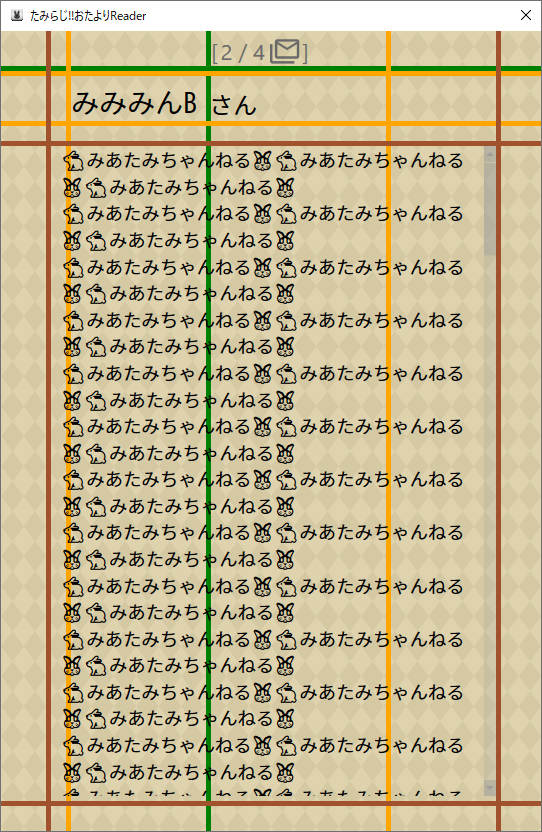

# たみらじ!!おたよりリーダー

お名前にあたる項目と本文にあたる項目を指定しCSVファイルを読み込むと，  
お好みの画像の上にお名前と本文が表示できるよ♪

## ☆ちょっとした使い方☆

### ☆インストールほうほう
[リリースページ](https://github.com/Kanna-mimimin/TamiradiOtayoriReader/releases)から最新版の「TamiradiOtayoriReader-Ver〇.〇.〇.zip」をダウンロードしてお好みの場所に展開するだけ！

### ☆準備
1. 背景用画像を用意しておきます．  
このアプリは読み込んだ画像に合わせて画面サイズが変化するので，ちょうどいいサイズの画像を用意しておいてください．

1. Googleフォームから集計結果のCSVファイルをダウンロードしておきます♪  
※ZIPで圧縮されているので，中身のCSVファイルだけ取り出しておいてね！  
※ファイル名が文字化けしている場合は，わかるように名前を変えておいてね！  
  
   

### ☆使ってみる♪
1. 起動してみる  
「TamiradiOtayoriReader.exe」を実行します．
起動するとデフォルトの画像でおたより画面が表示されます．  
  

1. おたよりを表示してみる  
おたより画面を右クリックするとコントロールパネル画面が開きます．  
「設定タブ」を選択すると設定画面が表示されます．   
おたより読込欄のおたよりCSVファイルパスに，準備しておいたCSVファイルを指定します．  
お名前にあたる項目名と本文にあたる項目名を指定して「読込」ボタンを押下すると，おたよりが読み込まれます．  
  
  
※このCSVファイルの場合はお名前の項目名が「お名前」、本文の項目名が「お題」になります．  

1. おたよりを選んでみる  
コントロールパネルの「おたより選択」タブを選んで，おたより選択画面を表示します．  
2つ前，1つ前，1つ次，2つ次のおたよりへ移動するボタンと各おたよりの投稿者と本文の内容が少しだけ表示されます．  
移動ボタンでそれぞれのおたよりへ移動できるよ♪  
本文が見えない場合はカーソルを合わせると本文の全文がポップアップで表示されるよ！  
スライダーを有効にすると，お好みのおたよりまで移動できるよ！！  

  

1. 背景画像や表示位置を調整してみる  
「設定タブ」 で色々調整ができるよ．  
背景画像設定のテキストボックスにお好みの背景画像を指定すると，お好みの画像が表示されます♪  
各種調整画面では文字の大きさや表示位置が調整できます．  
「保存ボタン」で設定を保存できるよ！  
※設定ファイルは実行ファイルと同じ場所に「TamiradiOtayoriReader.json」で保存されます．  
  
　  
各種調整枠を表示すると，おたより画面に調整用の枠が表示されます．  
この枠をつかんで表示位置を調整できます．  
※茶色枠中央部(本文表示領域)では枠がつかめないから注意！その場合は外周部に表示されている枠を掴んでね！  
  

1. 終了ほうほう  
間違えて閉じないようにわざと終了ボタンはつけてないよ！  
タスクバーから「たみらじ!!おたよりリーダー」を右クリックとかで終了してね！  

